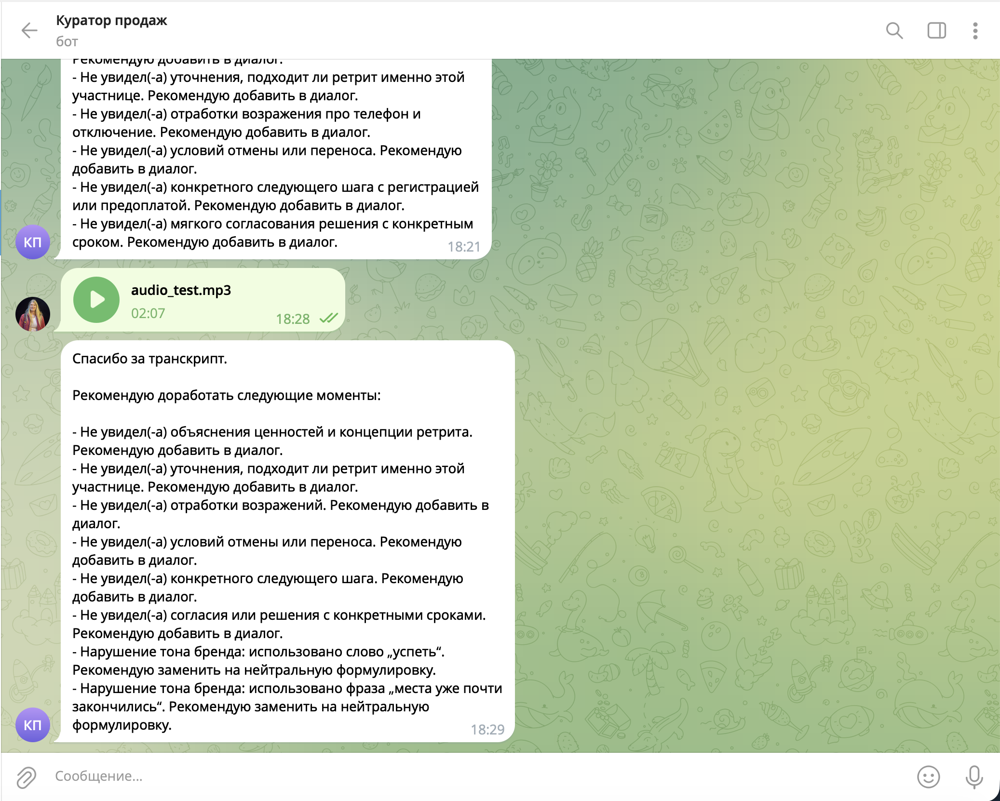

# Telegram-бот «Куратор качества продаж ретрита „Познай себя“»

## О проекте

Это Telegram-бот, который помогает руководителю отдела продаж ретрита «Познай себя» проверять качество разговоров менеджеров с потенциальными участницами. Менеджер или куратор присылает в чат запись звонка — бот возвращает короткий разбор: что в диалоге было упущено и над чем стоит поработать.

## Какую задачу решает

В продажах ретрита важно, чтобы менеджер провёл клиентку по конкретной логике разговора: установил тёплый контакт, выявил запрос, рассказал о программе и ценностях, обсудил стоимость, отработал сомнения и зафиксировал следующий шаг. Слушать и вручную разбирать каждый звонок долго и дорого, а оценки получаются субъективными.

Бот автоматизирует эту проверку:
- снимает с куратора рутину прослушивания записей,
- даёт одинаково строгую и единообразную оценку каждому диалогу,
- быстро показывает менеджеру, что именно стоит доработать в следующий раз.

## Как это работает простыми словами

1. Пользователь отправляет боту в Telegram запись разговора — голосовое, аудиофайл или видео.
2. Бот скачивает запись и переводит её в текст (расшифровывает речь).
3. Текст разговора отправляется на анализ языковой модели вместе со специальным промптом-инструкцией. В промпте описана роль куратора качества и 11 обязательных смысловых блоков, которые менеджер должен закрыть в разговоре (приветствие, выявление потребности, презентация программы, стоимость, работа с возражениями и т. д.).
4. Модель сверяет диалог с этими блоками и возвращает короткий отчёт.
5. Бот пересылает отчёт пользователю в чат и параллельно сохраняет всё в базу данных, чтобы можно было вернуться к истории проверок.

## Что получает пользователь

В ответ приходит аккуратный список рекомендаций. Сначала — пропущенные смысловые блоки, затем (если были) — отдельным блоком фиксируются нарушения тона бренда с точной цитатой слова или фразы из реплики менеджера. Все формулировки заданы заранее, поэтому отчёты всегда выдержаны в одном тоне, и менеджеров легко сравнивать между собой.

Если менеджер закрыл все 11 блоков и не нарушил тон бренда, бот пришлёт короткое: «Отлично проведённый диалог!»

Пример реального ответа бота на тестовую запись:

Каждая обработка (кто прислал, какой файл, расшифровка, итоговый аудит, статус успеха или ошибки) автоматически сохраняется в базе. Это даёт возможность позже собирать статистику: какие пункты пропускают чаще всего, как меняется качество разговоров со временем, кто из менеджеров растёт.

## Стек технологий

- **Python** — основной язык, на котором написана вся логика бота: приём сообщений, оркестрация вызовов внешних сервисов, работа с базой.
- **python-telegram-bot** — библиотека для общения с Telegram: получает входящие сообщения, скачивает присланные файлы, отправляет ответы и статусы обработки в чат.
- **AssemblyAI** — внешний сервис распознавания речи. Используется для того, чтобы превратить присланную аудио- или видеозапись в текст разговора. Поддерживает длинные записи и шумную запись с двух сторон.
- **OpenAI API (модель GPT-4.1 mini)** — языковая модель, которая выполняет сам аудит: получает расшифровку и инструкцию-промпт, сверяет диалог с 11 критериями и формирует итоговый отчёт по строгому шаблону.
- **Промпт-инжиниринг (`prompt.md`)** — отдельный файл с архитектурой промпта: ролью куратора, описанием 11 критериев, правилами тона и шаблонами формулировок. Логика аудита настраивается именно через этот файл, без переписывания кода.
- **PostgreSQL** — база данных, в которой сохраняется история обработок: метаданные, расшифровка, итоговый аудит и статус. Нужна для аналитики и для того, чтобы ничего не терялось при перезапуске.
- **psycopg2** — драйвер, через который Python общается с PostgreSQL.
- **Docker и Docker Compose** — контейнеризация. Позволяют одной командой поднять и сам бот, и базу данных в изолированном окружении — на сервере, в облаке или на ноутбуке. Удобно для деплоя и для повторяемых запусков.
- **dotenv** — подгружает приватные ключи (токен Telegram, ключи AssemblyAI и OpenAI, доступ к базе) из локального файла настроек, чтобы они не лежали в коде.
